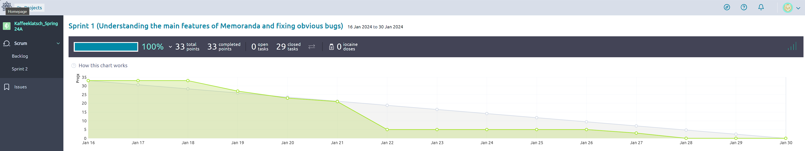

# Deliverable Information

> Please include your answers below in a good format, so it is easy for me to see. For answers to
> questions please use these Blockquotes. Make sure you also check the kickoff document for more
> details. Also make sure this thing is well formatted and the links are links in here.

## 1: Basic Information (needed before you start with your Sprint -- Sprint Planning)

**Topic you chose:** Topic 5: Gym Scheduling

**Sprint Number:** 1

**Scrum Master**: Jacob Smith

**Git Master**: Jack Quinn

### Sprint Planning (For Sprint 1-3)

Document your Sprint Planning here. Also check the kickoff document for more details on what needs
to be done. This is just the documentation.

**Sprint Goal:** Fully understand the functionality of memoranda, remove existing bugs in the
software, and set conditions to convert the code into the gym scheduling software.

**How many User Stories did you add to the Product Backlog:**  3

**How many User Stories did you add to this Sprint:** 11
> Answer the questions below about your Sprint Planning?

**Why did you add these US, why do you think you can get them done in the next Sprint?**

> We added the required US per the project docs and then 2 of the 3 US we added ourselves. Out of
> our custom US, we chose 2 that we thought would give us an understanding of the UI (without
> requiring a ton of coding) and would set the groundwork for features we want to add in Sprint 2.

**Why do you think these fit well with your Sprint goal? (details)**

> They line up perfectly with our spring goal of achieving a better understanding of the UI and
> setting ourselves up to implement more advanced features in the follow-on sprints.

**Do you have a rough idea what you need to do? (if the answer is no then please let me know on
Slack)**

> Yes!

## 2: During the Sprint

> Fill out the Meeting minutes during your Sprint and keep track of things. Update your Quality
> policies when needed, as explained in the lectures and in the Quality Policy documents on Canvas.
> I would also advise you to already fill out the Contributions section (End of sprint) as you go, to
> create less work at the end.

### Meeting minutes of your Daily Scrums (3 per week, should not take longer than 10 minutes):

> Add as many rows as needed and fill out the table. (Burndown starts with Sprint 2, and Continuous
> Integration starts with Sprint 3, not needed before that).

| Date        | Who did NOT attend   | Meeting notes (very brief)                                                                                                                                                                                                                                     | Burndown Info (on track, ahead behind is enough, Sprint 2,3) | GitHub Actions info (does the master pass, Sprint 3) | Additional Info |
|-------------|----------------------|----------------------------------------------------------------------------------------------------------------------------------------------------------------------------------------------------------------------------------------------------------------|--------------------------------------------------------------|------------------------------------------------------|-----------------|
| 19 JAN 2024 | All members attended | Reviewed sprint 1 goals and each member stated the tasks they're going to start with.                                                                                                                                                                          | N/A - Beginning of sprint                                    |                                                      |                 |
| 22 JAN 2024 | All members attended | Quick discussion of everyone's progress on their tasks and what they'll be working on next.                                                                                                                                                                    | Ahead                                                        |                                                      |                 |
| 24 JAN 2024 | All members attended | Update on individual progress and short discussion on getting over a barrier that was blocking progress on one of the US. Group collaboration led to quickly identifying the problem and implementing a permanent fix and the US was complete within the hour. | Ahead                                                        |                                                      |                 |
| 26 JAN 2024 | All members attended | Update on individual progress and quick discussion to identify any final problems that needed to be fixed prior to the end of the Sprint.                                                                                                                      | On track                                                     |                                                      |                 |
| 29 JAN 2024 | All members attended | Celebrate the end of Sprint 1, review admin/cleanup requirements for transition to sprint 2, begin sprint 2 planning.                                                                                                                                          | Sprint 1 complete!                                           |                                                      |                 |

## 3: After the Sprint

### Sprint Review

**Screen Cast Link**: https://youtu.be/TdBxDNfi4zk

> Answer the following questions as a team.

**What do you think is the value you created this Sprint?**

> We were able to understand the functionality of the current Memoranda software and get it to a
> stable and bug free state. We also began to setup some basic functionality for switching to the
> “Gymoranda” program along with multiple UI improvements.

**Do you think you worked enough and that you did what was expected of you?**

> We overestimated how long it would take to complete the majority of our user stories. Our burn
> down chart shows that we were able to accomplish most of the User Stories early in the sprint and
> then did not have much left. However, we completed all of the tasks that were expected of us.

**Would you say you met the customers’ expectations? Why, why not?**

> Yes, we exceeded the customer’s expectations as we finished all of our US’s on time and even made
> some changes outside the user stories that will accelerate our progress during the next sprint.

### Sprint Retrospective

> Include your Sprint retrospective here and answer the following questions in an evidence based
> manner as a team (I do not want each of your individuals opinion here but the team perspective). By
> evidence-based manner it means I want a Yes or No on each of these questions, and for you to provide
> evidence for your answer. That is, don’t just say "Yes we did work at a consistent rate because we
> tried hard"; say "we worked at a consistent rate because here are the following tasks we completed
> per team member and the rate of commits in our Git logs."

**Did you meet your sprint goal?**

> Yes, as a team we gained a solid understanding of Memoranda’s design and removed existing bugs to
> make the software more stable and maintainable in order to set conditions for implementing our
> overhaul into “Gymoranda '' during Sprint 2.

**Did you complete all stories on your Spring Backlog?**

> Yes

**If not, what went wrong?**

> N/A

**Did you work at a consistent rate of speed, or velocity? (Meaning did you work during the whole
Sprint or did you start working when the deadline approached.)**

> Due to the overestimations we made as described above in the sprint review and team members having
> various other commitments outside of this class/project, our team’s progress was not perfectly
> consistent.

**Did you deliver business value?**

> Cameron refactored much of the existing code to clean it up and make it more readable which will
> help us immensely throughout the rest of the project.

**Did you follow the Scrum process (e.g. move Tasks correctly?, keep the Taiga board up to date?
work consistently?)**

> Yes, we followed the scrum process and tasks were both assigned and updated on the Taiga board
> appropriately.

**Are there things the team thinks it can do better in the next Sprint? (not needed for last Sprint)
**

> Now that we have a better understanding of what we can accomplish during a two-week period, we’ll
> be able to make more accurate estimates for the next Sprint. This should lead to a more consistent
> workload/progress on the burndown chart.

**How do you feel at this point? Get a pulse on the optimism of the team.**

> Overall the team is happy with its performance and is ready to start rolling on development for
> the Sprint 2!

**Starting in Sprint 2**
Include a screenshot of your Burndown chart here and analyse in detail for me why it looks the way
it does and how you could improve it if it needs improving.

> 
> Test to practice embedding images with markdown!

### Contributions:

> In this section I want you to point me to your main contributions (each of you individually) for
> the current Sprint. Some of the below you will only need starting in later Sprints, I marked when
> they become important.

Copy the section for each team member and then everyone adds their individual contributions.

#### Team member Jack Quinn :

**Do you think you individually worked consistently and put in enough work into the project (give a
short answer).

Below I want links that I can click on to your commit or PullRequest with your work (not the branch
you worked on). I also want a short description what this commit/PR is about (or test etc.)

Example:
[Commit 1](https://github.com/amehlhase316/memoranda/commit/b949872433ae07f723bebe13c916064d03ef8882) -
Updated DeliverableX.md table to include who did not attend meetings

**Links to GitHub commits (not PR) with main code contribution (up to 5 links) during the current
Sprint:

[Commit 1](https://github.com/amehlhase316/Kaffeeklatsch_Spring24A/commit/b2f49626e4b6e63a7615540f1dcde915099f3de7) -
Changed splash page to use new Gymoranda logo.    
[Commit 2](https://github.com/amehlhase316/Kaffeeklatsch_Spring24A/commit/6ca4ac82c918cbbfe63d242fb338974388771cb8) -
Changed name to Gymoranda in multiple places as well as change to the new logo in the AboutBox.    
[Commit 3](https://github.com/amehlhase316/Kaffeeklatsch_Spring24A/commit/24703fa705baedb57ac398db6179b98a64a352ca) -
Add the Gymoranda logo.     
[Commit 4](https://github.com/amehlhase316/Kaffeeklatsch_Spring24A/commit/c597a1e15b0a27310cfbce167256f58c15c922af) -
Fixed window minimize and restore functionality.   
[Commit 5](https://github.com/amehlhase316/Kaffeeklatsch_Spring24A/commit/b417db751f64916ad1b72a7897c7289e3d61fa32) -
Added a placeholder for MemberType within the AppFrame

**GitHub links to your Pull Requests (up to 3 links) during the current Sprint:

[PR 1](https://github.com/amehlhase316/Kaffeeklatsch_Spring24A/pull/14) - PR for the placeholder for
MemberType.    
[PR 2](https://github.com/amehlhase316/Kaffeeklatsch_Spring24A/pull/6) - PR for adding and changing
the logos to use Gymoranda

#### Team member Landon Messmore :

**Do you think you individually worked consistently and put in enough work into the project (give a
short answer).

    On Sprint 1 our team was still learning the Scrum process and getting our feet wet. I had a hard time working consistently because we were able to finish our tasks and User Stories so quickly. 
    Within the first couple days ~3/4 of the tasks were already completed and the remaining ones were accounted for. 
    I believe I did put enough work into the project this Sprint, I was able to finish the User Stories that I took on and be available to help for the remaining ones that were left. 
    Next Sprint we will have a lot more on our plate so it will be easier to work and make commits consistently.

Below I want links that I can click on to your commit or PullRequest with your work (not the branch
you worked on). I also want a short description what this commit/PR is about (or test etc.)

Example:
[Commit 1](https://github.com/amehlhase316/memoranda/commit/b949872433ae07f723bebe13c916064d03ef8882) -
Updated DeliverableX.md table to include who did not attend meetings

**Links to GitHub commits (not PR) with main code contribution (up to 5 links) during the current
Sprint:

[Commit 1](https://github.com/amehlhase316/Kaffeeklatsch_Spring24A/commit/e584f9002e7c033594ea532f5ea4f33890db4f67) -
Change Sidebar names to reflect Gymoranda instead of Memoranda   
[Commit 2](https://github.com/amehlhase316/Kaffeeklatsch_Spring24A/commit/9182f5b5a98d625ea73bb36c95c1d36c78f37199) -
Add Code_Locations.txt which is used to track where in the codebase certain sections are   
[Commit 3](https://github.com/amehlhase316/Kaffeeklatsch_Spring24A/commit/e881bae5e8172209594c9e61336cee3d28ab09ac) -
Change Sidebar images to reflect Gymoranda instead of Memoranda

**GitHub links to your Pull Requests (up to 3 links) during the current Sprint:

[PR 1](https://github.com/amehlhase316/Kaffeeklatsch_Spring24A/pull/13) - PR for changing UI to
match the Gymoranda program instead of Memoranda program   
[PR 2](https://github.com/amehlhase316/Kaffeeklatsch_Spring24A/pull/15) - PR for changing sidebar
images to match Gymoranda

#### Team member Cameron Thieme :

**Do you think you individually worked consistently and put in enough work into the project (give a
short answer).

	I think that I did work consistently and put in enough work into the project. I was able to complete all the tasks I 
 	assigned to myself and I was always checking the Slack board to keep up to date with all the information as it came 
  	in. Due to this, I was able to help my teammates when they were stuck. When we started running out of tasks to do and 
   	the rest were all assigned to other teammates, after making sure they received any help necessary I started reading 
    through the code and rewriting it to make it easier to work with for the next sprint. I believe due to the mixture of 
	these reasons, I did work consistently and put in enough work.

Below I want links that I can click on to your commit or PullRequest with your work (not the branch
you worked on). I also want a short description what this commit/PR is about (or test etc.)

Example:
[Commit 1](https://github.com/amehlhase316/memoranda/commit/b949872433ae07f723bebe13c916064d03ef8882) -
Updated DeliverableX.md table to include who did not attend meetings

**Links to GitHub commits (not PR) with main code contribution (up to 5 links) during the current
Sprint:

[Commit 1](https://github.com/amehlhase316/Kaffeeklatsch_Spring24A/commit/1215a45a4a21c410a53b8c772b35fd7c952630ee) -
Remove deprecated code causing compiler errors   
[Commit 2](https://github.com/amehlhase316/Kaffeeklatsch_Spring24A/commit/401632dc49a788509d2e18a2bbfd34c612a57316) -
Remove deprecated code and replace repeating code with a method   
[Commit 3](https://github.com/amehlhase316/Kaffeeklatsch_Spring24A/commit/0c623a4b076ba42af9e69140953fb48e9ef6aae8) -
Start fix for minimize function by separating the close function from it   
[Commit 4](https://github.com/amehlhase316/Kaffeeklatsch_Spring24A/commit/dc2ffa87cb08c64f30f7a6f4489e796554c433bc) -
Refactor CurrentProject.java to make it more readable    
[Commit 5](https://github.com/amehlhase316/Kaffeeklatsch_Spring24A/commit/31f72b27e932adbf8395bc3cc3e1b88168d51e43) -
Refactor EventsScheduler.java to make it more readable

**GitHub links to your Pull Requests (up to 3 links) during the current Sprint:

[PR 1](https://github.com/amehlhase316/Kaffeeklatsch_Spring24A/pull/8) - PR to merge US#18, removing
error message on build, into Dev    
[PR 2](https://github.com/amehlhase316/Kaffeeklatsch_Spring24A/pull/16) - PR to merge US#10, fixing
minimize functionality, into Dev

#### Team member Dylan White :

**Do you think you individually worked consistently and put in enough work into the project (give a
short answer).

    I think I worked consistently and put enough work into the project despite moving across the country. Towards the end of the sprint when there were no more user stories to work on I had
    less communication because I didn't have any tasks to do any everyone seemed to be on track. Perhaps I could have done more checkups on the status of things but over all I'd say I put
    satisfactory work in on an individual level.

Below I want links that I can click on to your commit or PullRequest with your work (not the branch
you worked on). I also want a short description what this commit/PR is about (or test etc.)

Example:
[Commit 1](https://github.com/amehlhase316/memoranda/commit/b949872433ae07f723bebe13c916064d03ef8882) -
Updated DeliverableX.md table to include who did not attend meetings

**Links to GitHub commits (not PR) with main code contribution (up to 5 links) during the current
Sprint:

[Commit 1](https://github.com/amehlhase316/Kaffeeklatsch_Spring24A/commit/71e75c0a1c92d1bc483bd8819a09ec4c8fd2cca4) -
Made it so clicking X would correctly terminate Memoranda

[Commit 2](https://github.com/amehlhase316/Kaffeeklatsch_Spring24A/commit/7f03264f65eea110253cc301f6a6b52f34abded8) -
Translated import/export popups to English

[Commit 3](https://github.com/amehlhase316/Kaffeeklatsch_Spring24A/commit/451f32f25cef6f2a2a11893563f8c7239d22380a) -
Translated button texts to English

**GitHub links to your Pull Requests (up to 3 links) during the current Sprint:

[PR 1](https://github.com/amehlhase316/Kaffeeklatsch_Spring24A/pull/11) - Merge US#11 into Dev

[PR 2](https://github.com/amehlhase316/Kaffeeklatsch_Spring24A/pull/12) - Merge US#1 into Dev

#### Team member Natel Whitaker :

**Do you think you individually worked consistently and put in enough work into the project (give a
short answer).

	I do think I worked consistenly and put work into the project. I believe next sprint I was attempt to put more effort into more US's as I feel
 	I was lacking in that area this sprint and I have now learned to use git and the taiga board a bit better. I completed all the tasks I gave myself,
  	and attempted to help the others in my groups in anyway I could.

Below I want links that I can click on to your commit or PullRequest with your work (not the branch
you worked on). I also want a short description what this commit/PR is about (or test etc.)

Example:
[Commit 1] (https://github.com/amehlhase316/memoranda/commit/b949872433ae07f723bebe13c916064d03ef8882) -
Updated DeliverableX.md table to include who did not attend meetings

**Links to GitHub commits (not PR) with main code contribution (up to 5 links) during the current
Sprint:

[Commit 1](https://github.com/amehlhase316/Kaffeeklatsch_Spring24A/pull/9) - Repurposing Events Icon
and page to become Classes US-#31

[Commit 2](https://github.com/amehlhase316/Kaffeeklatsch_Spring24A/pull/10) - Setting up the
placeholder page for classes US-#32

[Commit 3](https://github.com/amehlhase316/Kaffeeklatsch_Spring24A/pull/19) - Adding UML diagram

**GitHub links to your Pull Requests (up to 3 links) during the current Sprint:

[PR 1](https://github.com/amehlhase316/Kaffeeklatsch_Spring24A/pull/8) - Merge US#18 into Dev

[PR 2](https://github.com/amehlhase316/Kaffeeklatsch_Spring24A/pull/16) - Merge US-#10 int Dev

#### Team member Jacob Smith :

**Do you think you individually worked consistently and put in enough work into the project (give a
short answer).

During this sprint, I took on more work on the project management side of the house as scrum master
and less on the individual user stories compared to my teammates,
but I think the level of effort was consistent. Everyone got off to a fantastic start while I had to
be away for a few days due to work. then I was able to come in
and help clean up the remaining tasks and wrap up the sprint! Additionally, I feel like I learned a
lot about Git and Taiga that will make me a more effective team
member during the next sprints.

**Links to GitHub commits (not PR) with main code contribution (up to 5 links) during the current
Sprint:

[Commit 1](https://github.com/amehlhase316/Kaffeeklatsch_Spring24A/commit/db2c28e5629e8b5f2f3bf634ae172a4301bdc52d) -
Added Deliverable1 to the repo and updated the team's answers to the planning phase questions.    
[Commit 2](https://github.com/amehlhase316/Kaffeeklatsch_Spring24A/commit/3ff3f5a30003aa91f555057a5cc16e97f5630839) -
Fixed bug that was preventing preferences from opening.    
[Commit 3](https://github.com/amehlhase316/Kaffeeklatsch_Spring24A/commit/d4f7305b4a55aae14555a58b38387e7cae7a4faf) -
Removed "Look and Feel" from the preferences menu and prepared code to be reused in the next sprint
as an option for implementing a new feature.   
[Commit 4](https://github.com/amehlhase316/Kaffeeklatsch_Spring24A/commit/0a5c246a19e7985b050231207ef908b84fa5062b) -
Updated standup meeting minutes on Deliverable1.   
[Commit 5](https://github.com/amehlhase316/Kaffeeklatsch_Spring24A/commit/4eac2cfc7ef08b036aabeb5a0ab76293b54c96e5) -
Added code review policy, developer checklist, and reviewer checklist.

**GitHub links to your Pull Requests (up to 3 links) during the current Sprint:

[Pull Request 1](https://github.com/amehlhase316/Kaffeeklatsch_Spring24A/pull/5) - Updated
deliverable 1 to include the team's planning information.   
[Pull Request 2](https://github.com/amehlhase316/Kaffeeklatsch_Spring24A/pull/18) - Completed US#12.
[Pull Request 3](https://github.com/amehlhase316/Kaffeeklatsch_Spring24A/pull/21) - Facilitated the
completion of team deliverables.

## Below is just for you as a little reminder on what needs to be done during the transition

### Checklist for you to see if you are done with the current Sprint, you do not have to check things off

- [ ] Form above is complete
- [ ] Your newest software is on the master branch on GitHub, it is tested and compiles/runs
- [ ] This document is in your master branch on GitHub
- [ ] Read the kickoff again to make sure you have all the details that I want
- [ ] User Stories that were not completed, were left in the Sprint and a copy created to move to
  the next Sprint
- [ ] Your Quality Policies are accurate and up to date
- [ ] **Individual** Survey was submitted **individually** (create checkboxes below -- see Canvas to
  get link)
    - [ ] Cameron
    - [ ] Jack
    - [ ] Dylan
    - [ ] Landon
    - [ ] Natel
    - [ ] Jacob

#### For the next Sprint

- [ ] The original of this file was copied for the next Sprint (needed for all but last Sprint where
  you do not need to copy it anymore)
    - [ ] Basic information (part 1) for next Sprint was included in this new Deliverable document
- [ ] You added new User Stories to your Product Backlog, they are correctly written (needed after
  Sprint 1, 2)
- [ ] All User Stories have acceptance tests
- [ ] User Stories in your new Sprint Backlog have initial tasks which are in New column
- [ ] You know how to proceed (if not please reach out)
