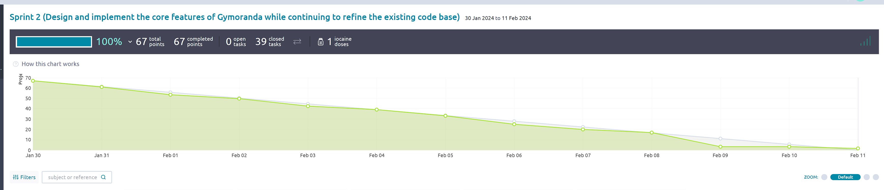

# Deliverable Information
   > Please include your answers below in a good format so it is easy for me to see. For answers to questions please use these Blockquotes. Make sure you also check the kickoff document for more details. Also make sure this thing is well formatted and the links are links in here. 

## 1: Basic Information (needed before you start with your Sprint -- Sprint Planning)

**Topic you chose:** Gym Scheduling "Gymoranda"

**Sprint Number:** 2

**Scrum Master**: Cameron Thieme

**Git Master**: Landon Messmore

### Sprint Planning (For Sprint 1-3)
Document your Sprint Planning here. Also check the kickoff document for more details on what needs to be done. This is just the documentation. 

**Sprint Goal:** Design and implement the core features of Gymoranda while continuing to refine the existing code base.

**How many User Stories did you add to the Product Backlog:**  10

**How many User Stories did you add to this Sprint:** 10
> Answer the questions below about your Sprint Planning?

**Why did you add these US, why do you think you can get them done in the next Sprint?**

> We selected user stories that would get us started on building out the new core features for gymoranda. Each team member will essentially be able to work on one core feature which we estimate to be an appropriate workload for the sprint cycle.

**Why do you think these fit well with your Sprint goal? (details)**

> Our goal for this sprint is for the software to start looking and functioning less like memoranda and more like our gym scheduler. Working on this set of US directly supports that goal.

**Do you have a rough idea what you need to do? (if the answer is no then please let me know on Slack)**

> Yes

## 2: During the Sprint
> Fill out the Meeting minutes during your Sprint and keep track of things. Update your Quality policies when needed, as explained in the lectures and in the Quality Policy documents on Canvas. 
I would also advise you to already fill out the Contributions section (End of sprint) as you go, to create less work at the end.

### Meeting minutes of your Daily Scrums (3 per week, should not take longer than 10 minutes):
> Add as many rows as needed and fill out the table. (Burndown starts with Sprint 2, and Continuous Integration starts with Sprint 3, not needed before that). 

| Date        | Who did NOT attend   | Meeting notes (very brief)                                                                                        | Burndown Info (on track, ahead behind is enough, Sprint 2,3) | GitHub Actions info (does the master pass, Sprint 3) | Additional Info              |
|-------------|----------------------|-------------------------------------------------------------------------------------------------------------------|--------------------------------------------------------------|------------------------------------------------------|------------------------------|
| 31 JAN 2024 | All members attended | Reviewed Sprint 2 goals and each member stated the tasks they're going to start with.                             | N/A - Beginning of Sprint                                    |                                                      |                              |
| 2 FEB 2024  | All members attended | Quick discussion of everyone's progress as well as next steps for completing the tasks with large dependencies.   | On track                                                     |                                                      |                              |
| 5 FEB 2024  | All members attended | Update on individual progress and short discussion to help a member get past a barrier stopping progress on a US. | On track                                                     |                                                      |                              |
| 7 FEB 2024  | All members attended | Quick discussion on current progress, no issues slowing progress found.                                           | On track                                                     |                                                      |                              |
| 9 FEB 2024  | All members attended | Update on individual progress and short discussion to determine the work needed to wrap up the sprint.            | Ahead                                                        |                                                      | Final meeting of the Sprint. |

## 3: After the Sprint

### Sprint Review
Answer as a team!

**Screen Cast link**: https://youtu.be/gDVEqxbLZa0

> Answer the following questions as a team. 

**What do you think is the value you created this Sprint?**

> As a team, we were able to begin developing and implementing the “Gymoranda” features we believe the program should have. A large portion of the backend was completed, allowing us to focus largely on improving the UI portion next Sprint.

**Do you think you worked enough and that you did what was expected of you?**

> Our burndown chart follows the estimated line closely while remaining slightly under for the large majority of the Sprint. We believe we did work enough as we were able to complete all of our User Stories by the end of the Sprint.

**Would you say you met the customers’ expectations? Why, why not?**

> We did meet the customer’s expectations. All of the User Stories we promised to complete were completed at the end of the Sprint.

### Sprint Retrospective

> Include your Sprint retrospective here and answer the following questions in an evidence based manner as a team (I do not want each of your individuals opinion here but the team perspective). By evidence-based manner it means I want a Yes or No on each of these questions, and for you to provide evidence for your answer. That is, don’t just say "Yes we did work at a consistent rate because we tried hard"; say "we worked at a consistent rate because here are the following tasks we completed per team member and the rate of commits in our Git logs."

**Did you meet your sprint goal?**

> Our goal was to design and implement core features of Gymoranda while also refining the existing code base. We believe this goal was met as a large portion of the Gymoranda functionality was added to the program, including but not limited to a user login, a page displaying the Trainers, a page displaying the Rooms, and a page displaying the available Classes. We were also able to refactor code that was still necessary and remove portions of the existing code that were no longer needed for our uses.

**Did you complete all stories on your Spring Backlog?**

> Yes, all the stories in the sprint backlog were completed by the end of the Sprint.

**If not, what went wrong?**

> N/A

**Did you work at a consistent rate of speed, or velocity? (Meaning did you work during the whole Sprint or did you start working when the deadline approached.)**

> While each of our members had various other commitments and were not able to work on the project every day, the progress made on the Sprint was consistent. The Burndown chart for our Sprint follows the estimated line very closely until the last few days of the Sprint where we get ahead.

**Did you deliver business value?**

> We did deliver bonus value. Jake was able to start work on tasks that would be needed for Sprint 3. He added UI elements and wrote comments specifying what needed to be done for the feature to be properly implemented. This helps prepare us for Sprint 3 and will allow for the start of the Sprint to be smooth.

**Did you follow the Scrum process (e.g. move Tasks correctly?, keep the Taiga board up to date? work consistently?)**

> Yes, we followed the Scrum process and kept the Taiga board up to date. Every member participated in the Daily Scrums allowing us to all be kept up to date with the current status of the Sprint. Tasks in the Taiga board were properly assigned to members and moved through the stages of development.

**Are there things the team thinks it can do better in the next Sprint? (not needed for last Sprint)**

> One large issue that occurred during the start of the Sprint was the large amount of dependencies between the User Stories. This was due to the backend that needed to be developed that almost all of the User Stories used. As a team, we can spend more time creating the User Stories to limit the overall dependencies and to create a plan for handling any dependencies that do occur.

**How do you feel at this point? Get a pulse on the optimism of the team.**

> Overall, the team is very happy with the completion of the Sprint. We were able to complete all of the commitments we made and our Burndown chart vastly improved from the last Sprint. We are excited to see what we can complete within the last Sprint.

**Starting in Sprint 2**
Include a screenshot of your Burndown chart here and analyse in detail for me why it looks the way it does and how you could improve it if it needs improving. 

> Our burn down chart shows that our expectations for what we can get done and the consistency of our work improved greatly from the previous sprint. 
> Due to the nature of our team's schedule dynamic and needed to meet entirely asynchronously, we went with the relative mass approach to assigning scores to user stories. 
> We could see this method not always being the most effective, especially if we didn't have a good idea of what our other team members can get done, but it turned out to provide a good estimate for this sprint.
> We made a lot of progress going into the final weekend (the big dip on 9 Feb) and then Cameron brought us home with wrapping up the final task on the last day.

### Contributions:

> In this section I want you to point me to your main contributions (each of you individually) for the current Sprint. Some of the below you will only need starting in later Sprints, I marked when they become important. 

Copy the section for each team member and then everyone adds their individual contributions. 

#### Team member -- Jack Quinn:

  **Do you think you individually worked consistently and put in enough work into the project (give a short answer). 
  
Yes, I believe that I worked consistently and put in a good amount of work into the project.  I was also able to help out others when I wasn't directly working on any of my own Tasks.

 Below I want links that I can click on to your commit or PullRequest with your work (not the branch you worked on). I also want a short description what this commit/PR is about (or test etc.)

  Example: 
  [Commit 1](https://github.com/amehlhase316/memoranda/commit/b949872433ae07f723bebe13c916064d03ef8882) - Updated DeliverableX.md table to include who did not attend meetings

  **Links to GitHub commits (not PR) with main code contribution (up to 5 links) during the current Sprint:

   [Commit 1](https://github.com/amehlhase316/Kaffeeklatsch_Spring24A/commit/2c87d8435d4259fe84840bb6202a3dac3924f673) - Created a User class as well as integrated the Login and Signup functionality.
   
   [Commit 2](https://github.com/amehlhase316/Kaffeeklatsch_Spring24A/commit/53f3ec63a5d27227c8cb5f6a78610c4ef9090a27) - Built Login and Signup UI.
   
   [Commit 3](https://github.com/amehlhase316/Kaffeeklatsch_Spring24A/commit/c82a7f882200815eb50f587504d7d9002674272f) - Continued to create functionality for the Rooms.
   
   [Commit 4](https://github.com/amehlhase316/Kaffeeklatsch_Spring24A/commit/88fead1a14db2b73b2ea5ec8c7b2f8239d2f4cc1) - Added UI to allow an Owner to add a Class.
   
   [Commit 5](https://github.com/amehlhase316/Kaffeeklatsch_Spring24A/commit/bdea3f7d19cd12b844c78d3b062d9e44e21a6b03) - Added UI functionality to let owner delete a Course.
   

  **GitHub links to your Pull Requests (up to 3 links) during the current Sprint:

   [PR 1](https://github.com/amehlhase316/Kaffeeklatsch_Spring24A/pull/31) - PR for room functionality.
   
   [PR 2](https://github.com/amehlhase316/Kaffeeklatsch_Spring24A/pull/23) - PR for Login and Signup Ui and functionality.
   
   [PR 3](https://github.com/amehlhase316/Kaffeeklatsch_Spring24A/pull/35) - PR for UI for an owner to add a class.
   

   **GitHub links to your Unit Tests (up to 3 links) -- during current Sprint, start in Sprint 2 (everyone should write 4 good Unit Tests each Sprint):

   [Unit Test 1](https://github.com/amehlhase316/Kaffeeklatsch_Spring24A/commit/972bed846b0f761a28a50a7b7ee83785220b1774) - Unit tests for the getNext5Classes function.
   
   [Unit Test 2](https://github.com/amehlhase316/Kaffeeklatsch_Spring24A/commit/ebf95b9f16789041ba867f7f0c6c39334d8ce499) - Unit tests for deleteCourseById.
   
   [Unit Test 3](https://github.com/amehlhase316/Kaffeeklatsch_Spring24A/commit/c82a7f882200815eb50f587504d7d9002674272f) - Unit tests for Rooms functionality.
   

  
  **GitHub links to your Code Reviews (up to 3 links) -- during current Sprint, start in Sprint 2:

   [Code Review 1](https://github.com/amehlhase316/Kaffeeklatsch_Spring24A/pull/44) - Code review for PR made by Jake.
   
   [Code Review 2](https://github.com/amehlhase316/Kaffeeklatsch_Spring24A/pull/40) - Code review for PR made by Cameron.
   
   [Code Review 3](https://github.com/amehlhase316/Kaffeeklatsch_Spring24A/pull/43) - Code review for PR made by Landon.
   

  **How did you contribute to Static Analysis -- during current Sprint, start in Sprint 2:

    - link1
    - link2

 
#### Team member -- Landon Messmore:

  **Do you think you individually worked consistently and put in enough work into the project (give a short answer). 

	I do believe I worked consistently and put in enough work into the project. 
 	I worked either every day or every other day on a piece of functionality that was large and complicated for me. 
  	I think what I accomplished this sprint was a significant piece of functionality and it may make our next sprint easier 
   	by serving as a blueprint of a possible way to implement the pages' UI and cross-functionality between classes.  

 Below I want links that I can click on to your commit or PullRequest with your work (not the branch you worked on). I also want a short description what this commit/PR is about (or test etc.)

  Example: 
  [Commit 1](https://github.com/amehlhase316/memoranda/commit/b949872433ae07f723bebe13c916064d03ef8882) - Updated DeliverableX.md table to include who did not attend meetings

  **Links to GitHub commits (not PR) with main code contribution (up to 5 links) during the current Sprint:

  [Commit 1](https://github.com/amehlhase316/Kaffeeklatsch_Spring24A/commit/50b81271b4def214f7f9c8ac80c791c80bd79193) - Began creating UI for 'Rooms' page.
  
  [Commit 2](https://github.com/amehlhase316/Kaffeeklatsch_Spring24A/commit/9847c97ee4625a9a957a7ec066fc05f5c91e1fc9) - Added function that populates table data for when there are classes in a room.
  
  [Commit 3](https://github.com/amehlhase316/Kaffeeklatsch_Spring24A/commit/797678d20f26af2c3ee010c918f75609ac7a1efa) - Updated RoomPanel.java with a DefaultTableModel in order to update table when data changed.
  
  [Commit 4](https://github.com/amehlhase316/Kaffeeklatsch_Spring24A/commit/2df96dfe97fd9e2fdcf4e07ffc5af2d9dc2e0075) - Added date and time attributes and functionality to 'classes'.
  
  [Commit 5](https://github.com/amehlhase316/Kaffeeklatsch_Spring24A/commit/cce5f91fff0c1c43d0e187f427bc643422313816) - Added signup button and functionality to RoomPanel.java.
  

  **GitHub links to your Pull Requests (up to 3 links) during the current Sprint:

  [PR 1](https://github.com/amehlhase316/Kaffeeklatsch_Spring24A/pull/43) - This was my big project I worked on this sprint. Added 'Rooms' page UI and functionality to display all classes in each room on whatever day was selected on the calendar as well as give users a place to sign up for the classes.
  
  [PR 2](https://github.com/amehlhase316/Kaffeeklatsch_Spring24A/pull/39) - Added date and time attributes and methods to Room.java and refactored Rooms.java and RoomsTests to work with them

   **GitHub links to your Unit Tests (up to 3 links) -- during current Sprint, start in Sprint 2 (everyone should write 4 good Unit Tests each Sprint):

  [Unit Test 1 & 2](https://github.com/amehlhase316/Kaffeeklatsch_Spring24A/commit/c7ff72bf44880e5fe4f3d1cdb45b792883ccd002) - I updated 'deleteCourseById' to work with 'Courses' class after refactoring and I wrote 'testDateAndTimeGettersAndSetters'.

  Most of my work was centered around UI this Sprint so I wasn't able to write many unit tests.
  
  **GitHub links to your Code Reviews (up to 3 links) -- during current Sprint, start in Sprint 2:

  [Code Review 1](https://github.com/amehlhase316/Kaffeeklatsch_Spring24A/pull/41#pullrequestreview-1871569410) - Code Review for PR made by Natel. 

  [Code Review 2](https://github.com/amehlhase316/Kaffeeklatsch_Spring24A/pull/44#pullrequestreview-1873304138) - Code Review for PR made by Jake.

  [Code Review 3](https://github.com/amehlhase316/Kaffeeklatsch_Spring24A/pull/42#pullrequestreview-1871565502) - Code Review for PR made by Jack.

  **How did you contribute to Static Analysis -- during current Sprint, start in Sprint 2:

    - link1
    - link2

 #### Team member -- Cameron Thieme:

  **Do you think you individually worked consistently and put in enough work into the project (give a short answer). 

	I think that I did work consistently and put in enough work into the project. I was able to complete all the tasks I 
 	assigned to myself and I was always checking the Slack board to keep up to date with all the information as it came 
  	in. I helped implement features constantly throughout the Sprint which can be seen through my PRs as I made some at 
    the beginning, the middle and the end of the Sprint. I also attempted tasks that were out of my comfort level in order
    to learn more and help out my team.

 Below I want links that I can click on to your commit or PullRequest with your work (not the branch you worked on). I also want a short description what this commit/PR is about (or test etc.)

  Example: 
  [Commit 1](https://github.com/amehlhase316/memoranda/commit/b949872433ae07f723bebe13c916064d03ef8882) - Updated DeliverableX.md table to include who did not attend meetings

  **Links to GitHub commits (not PR) with main code contribution (up to 5 links) during the current Sprint:

 [Commit 1](https://github.com/amehlhase316/Kaffeeklatsch_Spring24A/commit/90948d4b4aefd9c115f8b20cf78512ada6b2edd2) - Create Trainer class to store Trainer objects for future User Stories
 
 [Commit 2](https://github.com/amehlhase316/Kaffeeklatsch_Spring24A/commit/9b79d6ba25d2bf18fce1c2cc3c4a64ce69fb6b38) - Update User.java to implement UserType and BeltValue enumerated types to make code more readable
 
 [Commit 3](https://github.com/amehlhase316/Kaffeeklatsch_Spring24A/commit/1c25cb72f70a84e91121245f9c73adf2fe0587e2) - Add start and end availability attributes to Trainers to be used for scheduling
 
 [Commit 4](https://github.com/amehlhase316/Kaffeeklatsch_Spring24A/commit/0e93d14d35247c93424d623a547a2f6e1e15b749) - Update User.java to implement the availability attributes and properly store in users.json
 
 [Commit 5](https://github.com/amehlhase316/Kaffeeklatsch_Spring24A/commit/96145dc1538571d7b2ae17f01cd38e9e1f83f03e) - Update TrainerPanel.java to display the Trainer's availability
 

  **GitHub links to your Pull Requests (up to 3 links) during the current Sprint:

 [PR 1](https://github.com/amehlhase316/Kaffeeklatsch_Spring24A/pull/24) - Implement Trainer.java to create a Trainer class to be used for further development
 
 [PR 2](https://github.com/amehlhase316/Kaffeeklatsch_Spring24A/pull/28) - Update User.java to utilize enumerated types BeltValue and UserType
 
 [PR 3](https://github.com/amehlhase316/Kaffeeklatsch_Spring24A/pull/40) - Improve user experience by allowing Splash screen to be shown and open the program at Home Page
 

   **GitHub links to your Unit Tests (up to 3 links) -- during current Sprint, start in Sprint 2 (everyone should write 4 good Unit Tests each Sprint):

 [Unit Test 1](https://github.com/amehlhase316/Kaffeeklatsch_Spring24A/commit/d1931f4510f30b85f83887c2083a65a3ac30b780) - Unit tests for User.java functionality
 
 [Unit Test 2](https://github.com/amehlhase316/Kaffeeklatsch_Spring24A/commit/2279ede9c5617650b063145c30b63c3834322d57) - Unit tests for User.java start and end availability
 
 [Unit Test 3](https://github.com/amehlhase316/Kaffeeklatsch_Spring24A/commit/6a4d65e11f434e46f8e4110d11a112dadc52a95d) - Update JSONTest to be easily implemented by multiple Test classes and fix test cases for new implementation
 

  
  **GitHub links to your Code Reviews (up to 3 links) -- during current Sprint, start in Sprint 2:

 [Code Review 1](https://github.com/amehlhase316/Kaffeeklatsch_Spring24A/pull/23#issuecomment-1920580454) - Code Review for PR made by Jack
 
 [Code Review 2](https://github.com/amehlhase316/Kaffeeklatsch_Spring24A/pull/32#pullrequestreview-1866326382) - Code Review for PR made by Jake
 
 [Code Review 3](https://github.com/amehlhase316/Kaffeeklatsch_Spring24A/pull/37#pullrequestreview-1868749238) - Code Review for PR made by Jack
 

  **How did you contribute to Static Analysis -- during current Sprint, start in Sprint 2:

    - link1
    - link2

 #### Team member -- Dylan White:

  **Do you think you individually worked consistently and put in enough work into the project (give a short answer). 

    I think I work consistently and put enough work in that was needed from me this sprint. I was able to communicate on slack regularly 
    and did my assigned User Story. Due to how the User Stories were distributed, by the time I was done with mine there were no more
    available User Stories to work on so the latter half of the sprint I was unable to assist further, though if needed I would have.

 Below I want links that I can click on to your commit or PullRequest with your work (not the branch you worked on). I also want a short description what this commit/PR is about (or test etc.)

  Example: 
  [Commit 1](https://github.com/amehlhase316/memoranda/commit/b949872433ae07f723bebe13c916064d03ef8882) - Updated DeliverableX.md table to include who did not attend meetings

  **Links to GitHub commits (not PR) with main code contribution (up to 5 links) during the current Sprint:

[Commit 1](https://github.com/amehlhase316/Kaffeeklatsch_Spring24A/commit/7d20db042d5687f506584343e7662dbc3f14fa88) - Add Change belt menu + set belt method

[Commit 2](https://github.com/amehlhase316/Kaffeeklatsch_Spring24A/commit/5bc0af09a1ee017e663b9a8136c8f4d23cd2dea6) - Update belt rank to update user JSON file

[Commit 3](https://github.com/amehlhase316/Kaffeeklatsch_Spring24A/commit/a1f61fbe9e8c9b0081d8355f2b214b2c37862cf7) - Add UI feedback on belt set

[Commit 4](https://github.com/amehlhase316/Kaffeeklatsch_Spring24A/commit/5b630310f27e5330da56ff601f376a97d2f4d98b) - Change belt change button look

  **GitHub links to your Pull Requests (up to 3 links) during the current Sprint:

[PR 1](https://github.com/amehlhase316/Kaffeeklatsch_Spring24A/pull/33) - Display User's personal info on the Home page of the app. Also allow user to change belt rank.

   **GitHub links to your Unit Tests (up to 3 links) -- during current Sprint, start in Sprint 2 (everyone should write 4 good Unit Tests each Sprint):

  
  **GitHub links to your Code Reviews (up to 3 links) -- during current Sprint, start in Sprint 2:

[Code Review 1](https://github.com/amehlhase316/Kaffeeklatsch_Spring24A/pull/33#pullrequestreview-1866447393) - Code Review for Pull Req made by Jacob

  **How did you contribute to Static Analysis -- during current Sprint, start in Sprint 2:

 #### Team member -- Natel Whitaker:

  **Do you think you individually worked consistently and put in enough work into the project (give a short answer). 

	I think I worked relatively consistently trying to work on what I assigned myself a little each day or every other
 	day when I could. I believe I did put enough work into the project but I could have been a bit more proactive in helping
  	others with PRs and troubleshooting.

 Below I want links that I can click on to your commit or PullRequest with your work (not the branch you worked on). I also want a short description what this commit/PR is about (or test etc.)

  Example: 
  [Commit 1](https://github.com/amehlhase316/memoranda/commit/b949872433ae07f723bebe13c916064d03ef8882) - Updated DeliverableX.md table to include who did not attend meetings

  **Links to GitHub commits (not PR) with main code contribution (up to 5 links) during the current Sprint:

[Commit 1](https://github.com/amehlhase316/Kaffeeklatsch_Spring24A/commit/35dc0273ce6d5ae06e37d6d28a6236504e613ac1) - added tests for the trainer list
    
[Commit 2](https://github.com/amehlhase316/Kaffeeklatsch_Spring24A/commit/e98be462139c24a3968cd6be242071ed53a1ea47) - fixed logic error with getTrainer and added comments

  **GitHub links to your Pull Requests (up to 3 links) during the current Sprint:

[PR 1](https://github.com/amehlhase316/Kaffeeklatsch_Spring24A/pull/46) - Merge updated docs into dev

[PR 2](https://github.com/amehlhase316/Kaffeeklatsch_Spring24A/pull/46) - US-#70 creating UI for trainers

   **GitHub links to your Unit Tests (up to 3 links) -- during current Sprint, start in Sprint 2 (everyone should write 4 good Unit Tests each Sprint):

[TEST 1](https://github.com/amehlhase316/Kaffeeklatsch_Spring24A/blob/dev/src/test/java/TrainerListTest.java) - Trainer List tests

  
  **GitHub links to your Code Reviews (up to 3 links) -- during current Sprint, start in Sprint 2:

 [PR 1](https://github.com/amehlhase316/Kaffeeklatsch_Spring24A/pull/41) - US-#70 creating UI for trainers

 [PR 2](https://github.com/amehlhase316/Kaffeeklatsch_Spring24A/pull/46) - Merge updated docs into dev

  **How did you contribute to Static Analysis -- during current Sprint, start in Sprint 2:

 #### Team member -- Jacob Smith:

  **Do you think you individually worked consistently and put in enough work into the project (give a short answer). 

    This sprint I was able to actually get started at the beginning and got to code a lot more consistently. I challenged myself to learn new concepts related to 
    data persistence utilizing JSON files and to get more comfortable interacting with UI design in Java. I think I contributed a fair share this cycle and helped out
    my team members when possible to help us have a successful sprint!

 Below I want links that I can click on to your commit or PullRequest with your work (not the branch you worked on). I also want a short description what this commit/PR is about (or test etc.)

  **Links to GitHub commits (not PR) with main code contribution (up to 5 links) during the current Sprint:

[Commit 1](https://github.com/amehlhase316/Kaffeeklatsch_Spring24A/pull/32/commits/7750d48ecadbc346daf7c997b3f62f1cfe0e20db) - added save and load from a json file functionality for classes in the program.

[Commit 2](https://github.com/amehlhase316/Kaffeeklatsch_Spring24A/pull/29/commits/02c088503889786b59713d03b9f535b0aad37a37) - added a JSONTest superclass that all the test classes which handle json reading and writing can extend to create a clean
test environment without deleting local data. This helps avoid the situation where a client runs the software tests and it deletes all their user data. See adjacent commits for more code and changes to make it more compatible.

[Commit 3](https://github.com/amehlhase316/Kaffeeklatsch_Spring24A/pull/44/commits/161fa0198e4d30f780433018ab2638af99fe32e9) - Add the manage instructor popup window functionality.

[Commit 4](https://github.com/amehlhase316/Kaffeeklatsch_Spring24A/pull/32/commits/7750d48ecadbc346daf7c997b3f62f1cfe0e20db) - Added the Courses class (described below in PRs).
 

 **GitHub links to your Pull Requests (up to 3 links) during the current Sprint:

[PR 1](https://github.com/amehlhase316/Kaffeeklatsch_Spring24A/pull/32/files) - Updated build.gradle to include jacocoTestReport functionality for the project and added Course.java which creates a Course object
based on the classes.json data so that other classes don't need to worry about reading and writing to the json file and classes can be more easily interacted with. This PR also contains the associated unit tests.  

[PR 2](https://github.com/amehlhase316/Kaffeeklatsch_Spring24A/pull/27) - Developed PersistentClass which handles class persistence in the program. When a new class is added, it stores the data in a json file
and when the program is started, it loads the existing classes. This PR also contains associated unit tests.  

[PR 3](https://github.com/amehlhase316/Kaffeeklatsch_Spring24A/pull/44/files) - First dip into UI development. Added a "manage instructor" window to the courses panel that's opened by a button which shows up to users registered as an owner.   

   **GitHub links to your Unit Tests (up to 3 links) -- during current Sprint, start in Sprint 2 (everyone should write 4 good Unit Tests each Sprint):

[Unit Test 1](https://github.com/amehlhase316/Kaffeeklatsch_Spring24A/pull/32/commits/04227cf7733d873d762a385ed986c016312766c4) - test cases for removing a student from the course roster and updating the json file.

[Unit Test 2](https://github.com/amehlhase316/Kaffeeklatsch_Spring24A/pull/32/commits/fe6a305dc8a0e53c470a4dfea7ff4fa8e702450d) - Test cases for adding student to a course and updating the classes json file properly.

[Unit Test 3](https://github.com/amehlhase316/Kaffeeklatsch_Spring24A/pull/32/commits/ffee49e861d16b7d36019875361db4af4f5571f3) - Test cases for Courses.java that builds objects based on the json data.
  
  **GitHub links to your Code Reviews (up to 3 links) -- during current Sprint, start in Sprint 2:

[Code Review 1](https://github.com/amehlhase316/Kaffeeklatsch_Spring24A/pull/41#pullrequestreview-1873078971)

[Code Review 2](https://github.com/amehlhase316/Kaffeeklatsch_Spring24A/pull/43#pullrequestreview-1872427462)

 
  

## Below is just for you as a little reminder on what needs to be done during the transition
### Checklist for you to see if you are done with the current Sprint, you do not have to check things off
- [ ] Form above is complete
- [ ] Your newest software is on the master branch on GitHub, it is tested and compiles/runs
- [ ] This document is in your master branch on GitHub
- [ ] Read the kickoff again to make sure you have all the details that I want
- [ ] User Stories that were not completed, were left in the Sprint and a copy created to move to the next Sprint
- [ ] Your Quality Policies are accurate and up to date
- [ ] **Individual** Survey was submitted **individually** (create checkboxes below -- see Canvas to get link)
  - [ ] Team member 1
  - [ ] Team member 2

#### For the next Sprint
  - [ ] The original of this file was copied for the next Sprint (needed for all but last Sprint where you do not need to copy it anymore)
    - [ ] Basic information (part 1) for next Sprint was included in this new Deliverable document 
  - [ ] You added new User Stories to your Product Backlog, they are correctly written (needed after Sprint 1, 2)
  - [ ] All User Stories have acceptance tests
  - [ ] User Stories in your new Sprint Backlog have initial tasks which are in New column
  - [ ] You know how to proceed (if not please reach out)
