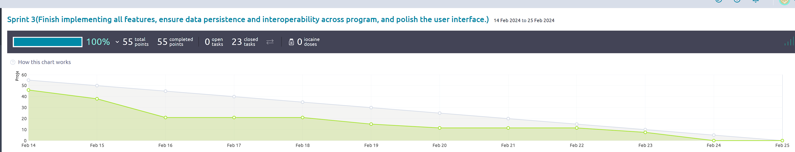

# Deliverable Information

> Please include your answers below in a good format, so it is easy for me to see. For answers to
> questions please use these Blockquotes. Make sure you also check the kickoff document for more
> details. Also make sure this thing is well formatted and the links are links in here.

## 1: Basic Information (needed before you start with your Sprint -- Sprint Planning)

**Topic you chose:** Gym Scheduling "Gymoranda"

**Sprint Number:** 3

**Scrum Master**: Natel Whitaker

**Git Master**: Dylan White

### Sprint Planning (For Sprint 1-3)

Document your Sprint Planning here. Also check the kickoff document for more details on what needs
to be done. This is just the documentation.

**Sprint Goal:** Finish implementing all features, ensure data persistence and interoperability
across program, and polish the user interface.

**How many User Stories did you add to the Product Backlog:**  15

**How many User Stories did you add to this Sprint:**
> We added 9 User Stories to our board this Sprint.

**Why did you add these US, why do you think you can get them done in the next Sprint?**

> We chose these User Stories because they add functionality that we deemed most important and
> beneficial to our project. We selected these 9 because
> we now have a better grasp of what our team can accomplish in a Sprint and we believe that
> they collectively require the exact amount of effort we're able to deliver with other course
> requirements as the semester wraps up.

**Why do you think these fit well with your Sprint goal? (details)**

> These fit well with our Sprint goal because they put the finishing touches on features we
> committed to delivering by tying together the last of our classes that need to share data,
> structuring our data in a more efficient manner, and making our user interface look professional
> and ready to hit the market.

**Do you have a rough idea what you need to do? (if the answer is no then please let me know on
Slack)**

> Yes

## 2: During the Sprint

> Fill out the Meeting minutes during your Sprint and keep track of things. Update your Quality
> policies when needed, as explained in the lectures and in the Quality Policy documents on Canvas.
> I would also advise you to already fill out the Contributions section (End of sprint) as you go,
> to
> create less work at the end.

### Meeting minutes of your Daily Scrums (3 per week, should not take longer than 10 minutes):

> Add as many rows as needed and fill out the table. (Burndown starts with Sprint 2, and Continuous
> Integration starts with Sprint 3, not needed before that).

| Date        | Who did NOT attend   | Meeting notes (very brief)                                                                       | Burndown Info (on track, ahead behind is enough, Sprint 2,3) | GitHub Actions info (does the master pass, Sprint 3) | Additional Info |
|-------------|----------------------|--------------------------------------------------------------------------------------------------|--------------------------------------------------------------|------------------------------------------------------|-----------------|
| 14 FEB 2024 | All members attended | Everyone seemed excited to start sprint 3! Eager to get tasks done.                              | N/A Start of sprint                                          | Master and Dev pass                                  |                 |
| 16 FEB 2024 | All members attended | Individual updates as well as noting being ahead.                                                | Ahead                                                        | Master and Dev pass                                  |                 |
| 19 FEB 2024 | All members attended | Individual updates.  Most tasks have been picked up                                              | Ahead                                                        | Master and dev pass                                  |                 |
| 21 FEB 2024 | All members attended | Individual updates.  Minor progress as most are focusing on individual assignment/other classes. | Ahead                                                        | Master and Dev pass                                  |                 |
| 23 FEB 2024 | All members attended | Individual updates.  Acknowledging end of sprint                                                 | Ahead                                                        | Master and dev pass                                  |                 |

## 3: After the Sprint

### Sprint Review

Answer as a team!

**Screen Cast link**: Your link

> Answer the following questions as a team.

**What do you think is the value you created this Sprint?**

> This sprint we created value by continuing to implement necessary features for Gymoranda. We also
> polished the user interface in many places to make the program look more appealing to the user and
> align with the program's use case. We added many features that would be seen in a real world
> application for gym scheduling which was exciting to see.

**Do you think you worked enough and that you did what was expected of you?**

> Yes as a team we worked hard enough and were able to meet our sprint goal. We were able to finish
> all of our user stories as well as add some additional storyless tasks throughout the sprint.

**Would you say you met the customers’ expectations? Why, why not?**

> Would you say you met the customer’s expectations? Why or why not?
> Based on our sprint goal of “Finish implementing features, ensure data persistence and polish the
> user interface”, we met the customer's expectations. We were able to finish many user stories that
> directly aligned with the goal of the sprint.

### Sprint Retrospective

> Include your Sprint retrospective here and answer the following questions in an evidence based
> manner as a team (I do not want each of your individuals opinion here but the team perspective).
> By
> evidence-based manner it means I want a Yes or No on each of these questions, and for you to
> provide
> evidence for your answer. That is, don’t just say "Yes we did work at a consistent rate because we
> tried hard"; say "we worked at a consistent rate because here are the following tasks we completed
> per team member and the rate of commits in our Git logs."

**Did you meet your sprint goal?**

> Yes! We met our sprint goal by aligning many of our user stories directly with the sprint goal and
> finishing these stories. We implemented a ton of new features, made the UI look more friendly and
> aligned with the use case of the program, and continued to work on data persistence.

**Did you complete all stories on your Spring Backlog?**

> Yes, we were able to complete all stories within our backlog.

**If not, what went wrong?**

> N/A

**Did you work at a consistent rate of speed, or velocity? (Meaning did you work during the whole
Sprint or did you start working when the deadline approached.)**

> We could have worked at a bit more of a consistent pace, however going into the sprint we knew
> that this wouldn’t be all that possible due to everyone having different schedules and other
> responsibilities. A large chunk of the work was done early on in the sprint, and then after that
> initial chunk, the work was quite consistent.

**Did you deliver business value?**

> Yes we delivered a significant amount of bonus value this sprint. After completing all the user
> stories we set out to finish during our planning and knowing there wouldn’t be another sprint, our
> team members continued implementing Owner features that we didn’t think we’d be able to accomplish
> originally with the intention of practicing new skills and techniques learned in the course.

> This includes adding the ability to assign and change instructors assigned to courses. The program
> only displays instructors that meet the minimum belt rank and have availability for the course.
> Another bonus feature is the ability for an owner to upgrade existing users to instructors.

**Did you follow the Scrum process (e.g. move Tasks correctly?, keep the Taiga board up to date?
work consistently?)**

> Yes, our team has gotten very good at following the Scrum process. Everyone consistently moved
> their tasks across the board during their work.

**Are there things the team thinks it can do better in the next Sprint? (not needed for last Sprint)
**

> Our scheduling and planning could have improved, but we knew that it wouldn’t be perfect in this
> sprint. There were times we were working very hard and then times later in the sprint where there
> was very little for other team members to do while the final tasks were being completed. We think
> that considering the extra end-of-semester chaos though, the team performed well.

**How do you feel at this point? Get a pulse on the optimism of the team.**

> We feel very good about our product! We are all very happy with what we accomplished and how we
> all worked together as a team. We were extremely efficient, all learned from each other,
> communicated well and were able to get an awesome product improvement done through this sprint.

**Starting in Sprint 2**
Include a screenshot of your Burndown chart here and analyse in detail for me why it looks the way
it does and how you could improve it if it needs improving.

> Our trend line isn't as spot on as it was in our previous sprint. We used the relative mass
> approach for US scoring again but this time we had the extra variable of multiple big
> end-of-semester requirements from all of our courses competing for our attention in addition
> to final exams. We intentionally pushed ahead at the start of the sprint to ensure we finished
> the minimum amount of features we wanted to see implemented, and then consistently worked over
> the remainder of the sprint. Overall we did end up completing all of our US on time and given
> the nature of everyone's schedule and conflicting requirements, our team is extremely happy
> with our performance.

### Contributions:

> In this section I want you to point me to your main contributions (each of you individually) for
> the current Sprint. Some of the below you will only need starting in later Sprints, I marked when
> they become important.

Copy the section for each team member and then everyone adds their individual contributions.

#### Team member <A> -- replace <A> with your name:

**Do you think you individually worked consistently and put in enough work into the project (give a
short answer).

Below I want links that I can click on to your commit or PullRequest with your work (not the branch
you worked on). I also want a short description what this commit/PR is about (or test etc.)

Example:
[Commit 1](https://github.com/amehlhase316/memoranda/commit/b949872433ae07f723bebe13c916064d03ef8882) -
Updated DeliverableX.md table to include who did not attend meetings

**Links to GitHub commits (not PR) with main code contribution (up to 5 links) during the current
Sprint:

    - link1
    - link2

**GitHub links to your Pull Requests (up to 3 links) during the current Sprint:

    - link1
    - link2

**GitHub links to your Unit Tests (up to 3 links) -- during current Sprint, start in Sprint 2 (
everyone should write 4 good Unit Tests each Sprint):

    - link1
    - link2

**GitHub links to your Code Reviews (up to 3 links) -- during current Sprint, start in Sprint 2:

    - link1
    - link2

**How did you contribute to Static Analysis -- during current Sprint, start in Sprint 2:

    - link1
    - link2

#### Team Member -- Cameron Thieme

**Do you think you individually worked consistently and put in enough work into the project (give a
short answer).

**Links to GitHub commits (not PR) with main code contribution (up to 5 links) during the current
Sprint:

    - link1
    - link2

**GitHub links to your Pull Requests (up to 3 links) during the current Sprint:

    - link1
    - link2

**GitHub links to your Unit Tests (up to 3 links) -- during current Sprint, start in Sprint 2 (
everyone should write 4 good Unit Tests each Sprint):

    - link1
    - link2

**GitHub links to your Code Reviews (up to 3 links) -- during current Sprint, start in Sprint 2:

    - link1
    - link2

**How did you contribute to Static Analysis -- during current Sprint, start in Sprint 2:

    - link1
    - link2

#### Team Member -- Landon Messmore

**Do you think you individually worked consistently and put in enough work into the project (give a
short answer).

**Links to GitHub commits (not PR) with main code contribution (up to 5 links) during the current
Sprint:

    - link1
    - link2

**GitHub links to your Pull Requests (up to 3 links) during the current Sprint:

    - link1
    - link2

**GitHub links to your Unit Tests (up to 3 links) -- during current Sprint, start in Sprint 2 (
everyone should write 4 good Unit Tests each Sprint):

    - link1
    - link2

**GitHub links to your Code Reviews (up to 3 links) -- during current Sprint, start in Sprint 2:

    - link1
    - link2

**How did you contribute to Static Analysis -- during current Sprint, start in Sprint 2:

    - link1
    - link2

#### Team Member -- Jack Quinn

**Do you think you individually worked consistently and put in enough work into the project (give a
short answer).
I think I put in enough work this sprint as I was able to complete a few US's that added value to
the project. I wasn't able to work all that consistently, and I knew that I wouldn't be able to
allocate too much time later in the sprint to the project, therefore I did most of my work in the
first few days.

**Links to GitHub commits (not PR) with main code contribution (up to 5 links) during the current
Sprint:

[Commit1](https://github.com/amehlhase316/Kaffeeklatsch_Spring24A/commit/9f74dc98778ceb3f27b4e4078bf27661fc668f55) -
Added function to get trainers available at a certain time based on their availability.

[Commit2](https://github.com/amehlhase316/Kaffeeklatsch_Spring24A/commit/2f33680082b159d5857d3f64d032a560a33ab210) -
Began adding the UI for the trainers to be able to set their availability.

[Commit3](https://github.com/amehlhase316/Kaffeeklatsch_Spring24A/commit/55d9ce95201f6c18fb3fb4410a886466e8199c6f) -
Added UI for allowing the user to change their password.

[Commit4](https://github.com/amehlhase316/Kaffeeklatsch_Spring24A/commit/0daf6f048e8ce62d95fdcfe478cfc5fa30327cf5) -
Integrated the UI to allow trainers to set their start and end times.

[Commit5](https://github.com/amehlhase316/Kaffeeklatsch_Spring24A/commit/78da7c482a6246067d2f478912df79c12d360022) -
Added the funcitonality for the user to change their password.

**GitHub links to your Pull Requests (up to 3 links) during the current Sprint:

[PR1](https://github.com/amehlhase316/Kaffeeklatsch_Spring24A/pull/58) - PR for allowing the
trainers to set their schedules within the UI.

[PR2](https://github.com/amehlhase316/Kaffeeklatsch_Spring24A/pull/53) - PR for setting the
rooms.json file properly if no rooms are found.

[PR3](https://github.com/amehlhase316/Kaffeeklatsch_Spring24A/pull/52) - PR for Personal Section and
allow the user to see their upcoming classes as well as change their password.

**GitHub links to your Unit Tests (up to 3 links) -- during current Sprint, start in Sprint 2 (
everyone should write 4 good Unit Tests each Sprint):

[Unit Test 1](https://github.com/amehlhase316/Kaffeeklatsch_Spring24A/commit/9fa8e6f67b487b75fb63c05802a1ea2589a772fb) -
Unit test for changing password.

[Unit Test 2](https://github.com/amehlhase316/Kaffeeklatsch_Spring24A/commit/c877ed189b0383b5cfbba6b0c49bb91ad02e67ff) -
Unit test for trainer updating their availability.

[Unit Test 3](https://github.com/amehlhase316/Kaffeeklatsch_Spring24A/commit/9f74dc98778ceb3f27b4e4078bf27661fc668f55) -
Unit test for getting trainers at a certain time.

**GitHub links to your Code Reviews (up to 3 links) -- during current Sprint, start in Sprint 2:

[Review 1](https://github.com/amehlhase316/Kaffeeklatsch_Spring24A/pull/69) - Review for a PR made
by Jacob.

[Review 2](https://github.com/amehlhase316/Kaffeeklatsch_Spring24A/pull/67) - Review for a PR made
by Cameron.

[Review 3](https://github.com/amehlhase316/Kaffeeklatsch_Spring24A/pull/68) - Review for a PR made
by Jacob.

**How did you contribute to Static Analysis -- during current Sprint, start in Sprint 2:

[Static Analysis 1](https://github.com/amehlhase316/Kaffeeklatsch_Spring24A/commit/5a74b8b28b7d890c4f9053a8ea2a783f0014306c) -
Added spotbugs to build.gradle as well as fixed spotbugs errors in User.java.

[Static Analysis 2](https://github.com/amehlhase316/Kaffeeklatsch_Spring24A/commit/68ff10b12c3a2e17484d1b81f23468812423afd7) -
Removed some spotbugs errors within the TrainerList.java file.

#### Team Member -- Dylan White

**Do you think you individually worked consistently and put in enough work into the project (give a
short answer).
I think I put in enough work this sprint, although most of it was at the start due to life circumstances forcing me to schedule my work early in the week.
Most of the work that was needed done was finished by my amazing team at an extremely fast pace by the time I was able to work once more, so there wasn't
much work left for me to take on towards the end of the sprint.

**Links to GitHub commits (not PR) with main code contribution (up to 5 links) during the current
Sprint:

    [Commit1](https://github.com/amehlhase316/Kaffeeklatsch_Spring24A/pull/61/commits/2b18026bf9612d976ffed95bde4862bfb9d61e7b) - Created a general use method
    to get the current list of teachers.
    
    [Commit2](https://github.com/amehlhase316/Kaffeeklatsch_Spring24A/pull/61/commits/68a900dabc2b5eabf17eedca7afcfb2cad93d05b) - Made it so the class creator
    displayed the available teachers to assign to the created class.
    
    [Commit3](https://github.com/amehlhase316/Kaffeeklatsch_Spring24A/pull/61/commits/638e7af53a46e33e338dd5f46e0bd34efee9e59f) - Added the ability to assign 
    teachers the the created class.
    
    [Commit4](https://github.com/amehlhase316/Kaffeeklatsch_Spring24A/pull/61/commits/005c4e3d99e82619433f5eea6d6a5bf9df62788f) - Created error handling for
    the method used to get current list of teachers, accounting for null values (no teachers yet).

**GitHub links to your Pull Requests (up to 3 links) during the current Sprint:

    [Pull Request](https://github.com/amehlhase316/Kaffeeklatsch_Spring24A/pull/61) - PR allowed the class creator to
    also be able to add teachers to a class, along with displaying results on the UI.

**GitHub links to your Unit Tests (up to 3 links) -- during current Sprint, start in Sprint 2 (
everyone should write 4 good Unit Tests each Sprint):

    There was no more viable classes to be unit tested.

**GitHub links to your Code Reviews (up to 3 links) -- during current Sprint, start in Sprint 2:

    [Code Review](https://github.com/amehlhase316/Kaffeeklatsch_Spring24A/pull/59#pullrequestreview-1884196040)

**How did you contribute to Static Analysis -- during current Sprint, start in Sprint 2:

    Static Analysis was properly covered by other team members, there was nothing I thought I could 
    contribute.

#### Team Member -- Natel Whitaker

**Do you think you individually worked consistently and put in enough work into the project (give a
short answer).

**Links to GitHub commits (not PR) with main code contribution (up to 5 links) during the current
Sprint:

    - link1
    - link2

**GitHub links to your Pull Requests (up to 3 links) during the current Sprint:

    - link1
    - link2

**GitHub links to your Unit Tests (up to 3 links) -- during current Sprint, start in Sprint 2 (
everyone should write 4 good Unit Tests each Sprint):

    - link1
    - link2

**GitHub links to your Code Reviews (up to 3 links) -- during current Sprint, start in Sprint 2:

    - link1
    - link2

**How did you contribute to Static Analysis -- during current Sprint, start in Sprint 2:

    - link1
    - link2

#### Team Member -- Jacob Smith

**Do you think you individually worked consistently and put in enough work into the project
(give a short answer).

Yes, I think I contributed a fair amount of effort to this sprint. Like my teammates, I
front-loaded a lot of effort knowing this final week would be a bit crazy, made some commits in
the middle, and then had another big push at the end of the sprint to wrap things up.

**Links to GitHub commits (not PR) with main code contribution (up to 5 links) during the current
Sprint:

[Commit 1](https://github.com/amehlhase316/Kaffeeklatsch_Spring24A/pull/69/commits/8b872b714a9e4c3ca990dbc870185b6e03e50c73)

- Created the GymUser class to make interacting and modifying users in the program easier as
  well as make it possible to modify users other than the one currently logged in.
- Updated TrainerPanel UI and created a NewTrainer popup window to handle upgrading members to
  trainers.

[Commit 2](https://github.com/amehlhase316/Kaffeeklatsch_Spring24A/pull/69/commits/608fcbbfad0a07954b80bca02d25b23307f82cd9)

- Updated User.java to be compatible with the new GymUser features and implement useful methods.
- Write action listener logic for new UI buttons.

[Commit 3](https://github.com/amehlhase316/Kaffeeklatsch_Spring24A/pull/55/commits/fa95e4b268920075c4517c1d7dedc265695301ae)

- Update ClassPanel structure to have basic and advanced course tabs.
- Ensures new course cards are placed into the correct tab.

[Commit 4](https://github.com/amehlhase316/Kaffeeklatsch_Spring24A/pull/55/commits/3d0fe74e847fc42c1b8124f038210e9b318d7078)

- Refine new class panel UI for displaying advanced courses
- Update save and load functionality for new variable to track if a course is advanced.

[Commit 5](https://github.com/amehlhase316/Kaffeeklatsch_Spring24A/pull/70/files)

- Update BeltValue enum to utilize the ordinal values in order to simplify the class.
- Removed redundant parameters and simplified related methods (isAdvanced and increaseBelt).

**GitHub links to your Pull Requests (up to 3 links) during the current Sprint:

[PR 1](https://github.com/amehlhase316/Kaffeeklatsch_Spring24A/pull/55)

- Added a feature to
  categorize courses as beginner or advanced and updated UI to display the course cards for each
  type separately, only showing advanced courses to users that meet the minimum belt req.

[PR 2](https://github.com/amehlhase316/Kaffeeklatsch_Spring24A/pull/69)

- Implemented "Add
  Trainer" functionality. Owners can upgrade an existing user to become a trainer.

[PR 3](https://github.com/amehlhase316/Kaffeeklatsch_Spring24A/pull/70)

- Implemented "Manage
  Instructor" functionality.
- Owners can assign instructors to courses that don't currently have
  one or change the instructor of a course.
- Instructor options presented to the owner are filtered
  to only show trainers that are available and meet the minimum belt rank req.

**GitHub links to your Unit Tests (up to 3 links) -- during current Sprint, start in Sprint 2 (
everyone should write 4 good Unit Tests each Sprint):

[Unit Test 1](https://github.com/amehlhase316/Kaffeeklatsch_Spring24A/pull/70/commits/b67ba4ca5d0f9bdddba0b94c05bab59b85db1fe8)

- Add tests to ensure both belt rank-related attributes are updated properly with the new features.

[Unit Test 2](https://github.com/amehlhase316/Kaffeeklatsch_Spring24A/pull/70/commits/9afd59452fb849ccfb02971355de3a73a931dbaf)

- Add tests to ensure the feature to upgrade existing users to trainers works properly.

[Unit Test 3](https://github.com/amehlhase316/Kaffeeklatsch_Spring24A/pull/55/commits/3d0fe74e847fc42c1b8124f038210e9b318d7078)

- Update course-related unit tests for new functionality.

**GitHub links to your Code Reviews (up to 3 links) -- during current Sprint, start in Sprint 2:

[Code Review 1](https://github.com/amehlhase316/Kaffeeklatsch_Spring24A/pull/53)

[Code Review 2](https://github.com/amehlhase316/Kaffeeklatsch_Spring24A/pull/61)

[Code Review 3](https://github.com/amehlhase316/Kaffeeklatsch_Spring24A/pull/67)

**How did you contribute to Static Analysis -- during current Sprint, start in Sprint 2:

[Static Analysis](https://github.com/amehlhase316/Kaffeeklatsch_Spring24A/pull/65/files)

- This was my biggest PR related to static analysis. I went through and corrected checkstyle
  warnings for all classes that have been added by our team and made a small dent on bulk
  checkstyle warnings for other classes such as indentation issues.

## Below is just for you as a little reminder on what needs to be done during the transition

### Checklist for you to see if you are done with the current Sprint, you do not have to check things off

- [ ] Form above is complete
- [ ] Your newest software is on the master branch on GitHub, it is tested and compiles/runs
- [ ] This document is in your master branch on GitHub
- [ ] Read the kickoff again to make sure you have all the details that I want
- [ ] User Stories that were not completed, were left in the Sprint and a copy created to move to
  the next Sprint
- [ ] Your Quality Policies are accurate and up to date
- [ ] **Individual** Survey was submitted **individually** (create checkboxes below -- see Canvas to
  get link)
    - [ ] Team member 1
    - [ ] Team member 2

#### For the next Sprint

- [ ] The original of this file was copied for the next Sprint (needed for all but last Sprint where
  you do not need to copy it anymore)
    - [ ] Basic information (part 1) for next Sprint was included in this new Deliverable document
- [ ] You added new User Stories to your Product Backlog, they are correctly written (needed after
  Sprint 1, 2)
- [ ] All User Stories have acceptance tests
- [ ] User Stories in your new Sprint Backlog have initial tasks which are in New column
- [ ] You know how to proceed (if not please reach out)
